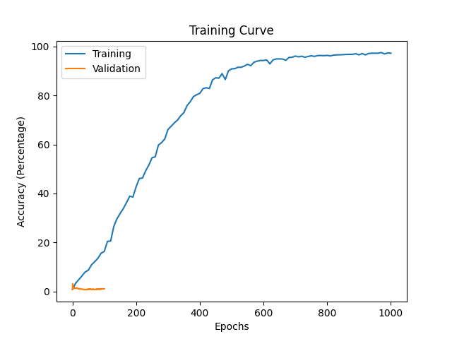

# Report 
**By Nirjari Gandhi & Vijay Nandlal**
---

## Introduction
Our task is to use the decoder layer of a transformer (modeled in the structure of GPT-2) to generate Sheakespeare sounding sentences using the plays *Romeo and Juliet* and *Hamlet*. Note that the entire transformer class was built from scratch using resources like https://jalammar.github.io/illustrated-transformer/,  https://nlp.seas.harvard.edu/2018/04/03/attention.html, https://jalammar.github.io/illustrated-gpt2/,  and the paper [Attention Is All You Need](https://proceedings.neurips.cc/paper_files/paper/2017/file/3f5ee243547dee91fbd053c1c4a845aa-Paper.pdf). The inputs to our model is 50 word long sentences taken from the two plays modeled in the form of one-hot vectors. The inputs had structure (batch length, sentence/sequence length, embedding size). Similarly the outputs are also one-hot vectors of the same shape. The embedding size of the raw one hot vector was 10086.

## Model Figure
Here is the structure of our model whose code is found in *Decode_only_transformer.py* using the class in *decode_custom.py*  

We built this model entirely from scratch. After parsing the data into groups of 50 sentences with a vocabulary size (embedding size 10086) we used a trainable weight matrix to reduce this dimensionality from 10086 to 768. Then using the positional encoding method we learned from class involving the Sine and Cosine functions we created a matrix with positional encodings with dimensionality (50, 768) to sum with the newly transformed word embeddings. This can be found in *Posencoding.py*. 

We then built the attention layer by first implementing single head attention, then multihead attention (found in *attention.py*). In implementing single head attention we first created three learnable matricies called the Query, Key and Value Matricies. These were responsible for producing the Query, Key, and Value vectors for every given word embedding, while simultaneously further reducing the embedding. As the formula from class and from https://jalammar.github.io/illustrated-transformer/ suggested we then multiplied the Query * *Keys Transposed* followed by normalization by the embedding size. This created the attention coefficent matrix. A square matrix of shape (sequence length, sequence length) which in our case was (49, 49). We also implemented the mask feature to zero out elements of the matrix (as a result of the softmax) to avoid scaling value vectors beloning to future unseen words in the sentence. Note that in our implementation we took note that the sequence length of the Query matricies need not be the same as the sequence length of the Key and Value matricies. This was originally designed to handle different sentence lengths from the encoder and decoder in the second multihead attention layer of the decoder. But this turned out not to be needed since we discarded the use of *Transformer.py* in favour of a decoder only model found in *Decode_only_transformer.py*. The attention coefficient matrix was then multiplied with the value matrix and was then returned.

In multihead attention each word had its embedding split by 8 and was then each group of (batch size, sequence length, embedding /8) was given to 8 different single head attention units. And was later recombined and had its embedding dimension rescaled to the original 768 by a learnable matrix.

After this followed a addition of the original inputs and a normalization.

Next was a feedforward network of 1 layer (found in *feedforward.py*) the hidden size used was 1000 but was also rescaled to its original 768 embedding size.

Again followed by an addition of the outputs of the multihead attention layer followed by a normalization.

We used a total of 3 of these layers in Blue that fed into eachother which is indicated by the yellow arrow.


## Model Parameters
First in the input embeddings we used a learnable matrix of size (10086, 768) to reduce the dimensionality. Note that there are 3 decoding layers, but the following describes the trainable matricies in 1 layer. In each of the 8 multihead attention layers there were 3 learnable matricies of size (1, 70, 768/8) (70 was the reduced embedding size after the embedding dimension split of 768/8). One for the Query, Key, and Value maricies. After the multihead attention there was a matrix of size (70 * 8, 768) to convert the reduced embeddings back to the original size (50, 768). In the feedforward layer there were probably two matricies used one of (768, 1000) and (1000, 768).

After the 3 decoding layers there was one matrix of (768, 10086) used to bring the outputs back to the original embedding size.

In total after using pytorch to count, there are 40,852,992 trainable weights

Using Pytorch to count:

```
from Decode_only_transformer import *
model = DecodeTransformer(3, 8, 10086, 768, 70, 1000, None)
parameters = list(model.parameters())
count = 0
for a in parameters:
    count += len(list(a.flatten()))
print(count)
```

## Model Examples
Sadly the the test accuracy was only 1.21 %, while it may have gotten words correctly it did not get entire lines correct. 

## Data Source
The data set that we intend to use for the project is a collection of Shakespeare’s plays. We were able to locate a website: https://www.folger.edu/explore/shakespeares-works/ which offers free access to all of the 37 plays that Shakespeare has written in his lifetime. This website provides the plays so that they can be used for educational purposes but doesn’t allow for the use of the data for redistribution or commercial purposes, which satisfies our requirements for the purposes of the project.

## Data Summary
In total the plays that we used contain 10,212 lines and 55,523 words. Using these 2 plays, we formed 1111 sets of 50 words each in order to form the 3 sets required to train, test and validate the model. This means that our training set had 888 sets of 50 words each, the testing set had 111 sets of 50 words each and validation set had 112 sets of 50 words each. 

## Data Transformation
The data was first collected from “https://www.folger.edu/explore/shakespeares-works/” and we chose to use the plays Romeo and Juliet and Hamlet in order to create the dataset. We downloaded the plays and removed the “Prologue”, “Act x” and “Scene x” headings and the line dividers following that. We also removed the heading indicating that actors were coming into the scene and leaving the scene as well as performing some actions. These headings were in the form of “[enter]”. Once the datasets were parsed and cleaned, we split the data into sets of 50 words in each list and converted each of those lists into one-hot vectors to be supplied into the model.

## Data Split
Once the data is cleaned, the data would be split into training, testing and validation sets respectively using the 80/10/10 dividing technique. The data is split in this way because a transformer requires more data points to be trained accurately and requires learning a lot as it wouldn't be able to make accurate predictions without knowing the context of how the words are used and what they mean. The testing and validation are both split to get 10% of data each so that we are able to test and validate the model accurately while also having the model trained properly to understand the context of the words being used in the sentences.

## Training Curve


This is a picture of our training curve. As you can see the validation accuracy was not signifigantly higher than 1%. We trained this model using the training set of approximately 888 sentences of 50 words each for 1000 epochs. We used the Adam optimizer and grouped our data into randomly shuffled batches with each epoch. We also implemented a scheduler to provide a warmup for the learning rate as the authors of the Attention Is All You Need Paper did as well. The validation accuracy is cut off on the graph despite being recorded in the same frequency as the training accuracy. 

## Hyperparameter Tuning
Initially we were using a the model we created in *Transformer.py* which consisted of both an encoder and decoder model. Originally we were planning to use 6 encoder layers and 6 decoder layers, while feeding 30 words into the encoder and having the decoder autoregressively predict the last 20 using teacher forcing. Even on the training set the accuracy was still very low despite training for over 12 hours. After getting some help from the professors we decided to implement our model from scratch in the form of GPT-2 using a multiple decoding layers with one multihead attention layer and no encoding layer. We used 3 decoding layers to reduce the amount of trainabe parameters as these made training longer and harder. To avoid the 12 hour training problem we were having before we decided to use a scheduler from the pytorch libraries that allowed us to replicate the learning rate warm up shown in the paper Attention is All You Need. Also from this paper, we used hyper parameters in our optimizer such as the beta1 and beta2 as well as the epsilon coefficients:

```torch.optim.Adam(model.parameters(recurse=True), lr=1, betas=(0.9, 0.98), eps=pow(10, -9))```

We also created this function to pass to the scheduler that would supply counter value and multiply the output by the initial learnign rate (1) the values involved in this computation were also taken from the Attention is All You Need paper we would have changed the embedding size from 512 to 768 but 512 also seemed to work well and given all the trouble we had training we decided to leave it alone:

```
def learn(x):
    return pow(512, -0.5) * min(pow(x+ 0.0001, -0.5), x * pow(4000, -0.5))
```

Note that the batch size of 50 sentences were chosen so that we could use a gpu without running out of memory for a faster training computation time.

We chose the value of 768 for the embedding inside the decoding layer since this is what GPT-2 used (https://jalammar.github.io/illustrated-gpt2/) and given our inexperience we went with this number.

## Quantitative Measures
To train our model we took the first 49 words of every sentence and let the model predict the 2nd to 50th word. This was faciliated using an attention mask to prevent the model from looking ahead further down the sentence. The accuracy of our model was how many of these words were predicted correctly given the previous words. In effect each sentence presented 49 tests for the model. 


## Quantitative and Qualitative Results
In terms of the quantantive results, the model performed really well on in learning the training set, but failed to capture enough information to properly predict sentences in the validation set. To us this indicates that the model was memorizing the words instead of learning them.

## Justification of Results
Our results were strange since the training accuracy was able to climb to 97 % after 1000 epoch while the validation accuracy struggled to climb pas 1.5 %. We believe that the cause of this was a small training set. While 888 training setnences seemed like a lot in comparison to some of the previous machine learning work we've done it was not big enough to accomplish a generative task such as this one. This realization came late and there was not enough time to retrain using more plays, and because we might not have had the gpu memory do deal with an increased data set. It is promising that the model can overfit a small data set such as our training set, but in the future we would need much more data so that the model can build better dependancies between words instead of memorizing words that should come next.

## Ethical Considerations
The creation of this model could cause ethical implications on the playwright community as this model would be able to produce plays similar to those of shakespeare. Shakespeare was the most popular and famous playwright and a model that is able to create plays as everlasting and classic can cause many playwright’s works to be disregarded and eventually cause them to lose their jobs. Using a model such as this one can cause ethical concerns within the playwright community as plays are considered to be best written by hand and from the heart and they could argue that a model creating the plays wouldn’t have the same effect and be considered unethical. 

Similarly students studying the works of Shakespeare could use this tool in an academically dishonest way. For instance if students were tasked with writing their own soliloquy as an assignment this tool has the potential to write the entire assignment for them. Also students tasked with playwriting could potentially have this tool write components of it for them.

## Authors
The tasks that we would have to do in order to achieve our goals are collecting data, cleaning data so that it can be used to train, test and validate the model, create mini batches and understand what the data represents, build the model and make architecture decisions relating to the model, create the train function for the model, select the correct hyperparameters to train the model, perform sanity checks such as overfitting the model, plot curves returned by the trained model, create the get_accuracy function for the model and use that function to check the accuracy of the model and improve parameters accordingly. 

The tasks will be divided as follows:
- Collecting data: Nirjari 
- Cleaning data: Nirjari
- Create mini-batches and understanding data: Nirjari
- Design model and make architecture decisions: Nirjari and Vijay
- Create encoder and decoder : Vijay and Nirjari
- Create train function: Vijay
- Train model and select hyperparameters accordingly: Vijay
- Perform sanity checks: Vijay
- Create plotting function: Nirjari 
- Use plotting function: Nirjari
- Create accuracy functions: Vijay
- Check accuracy of model and adjust parameters according to results: Vijay
- Create prediction function to predict next line in play: Nirjari

Note that a lot of commits were from Vijay's account since we often worked collaboratively through VS code share and Discord since I (Vijay) had the GPU.
Also note that Vijay's account had two names associated with commits, AvroAaron and VijayNandlal, as I worked from my Fedora Machine and Pop OS Machine and did not realize I had configured git differently for my two github accounts. Both of those accounts are Vijay's (mine) 


## Advanced Concept
Our model uses the advanced concepts of transformer to create a generative model. 


