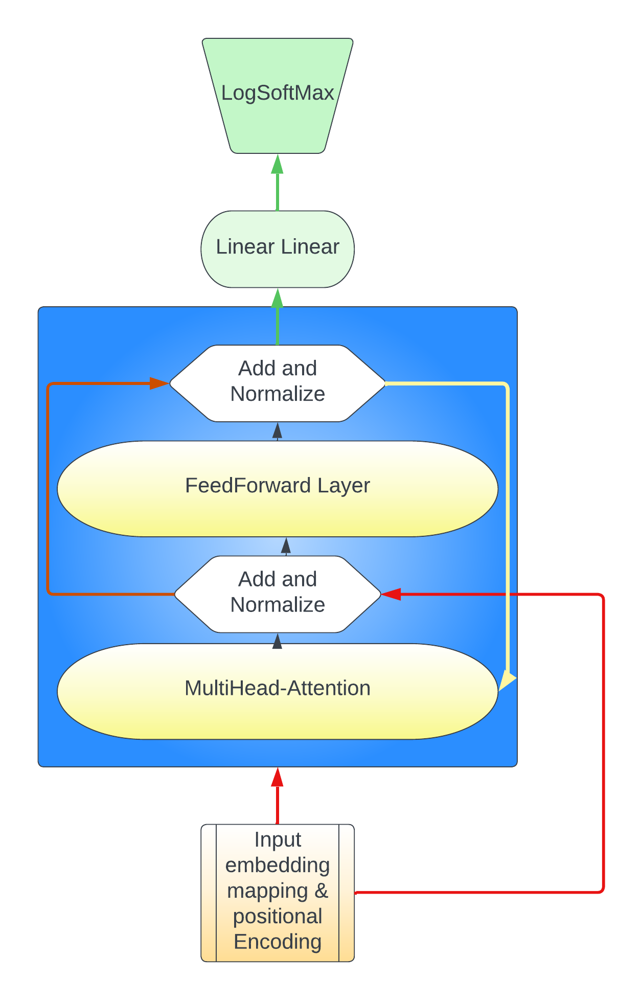

# Report 
**By Nirjari Gandhi & Vijay Nandlal**
---

## Introduction
Our task is to use the decoder layer of a transformer (modeled in the structure of GPT-2) to generate Sheakespeare sounding sentences using the plays *Romeo and Juliet* and *Hamlet*. Note that the entire transformer class was built from scratch using resources like https://jalammar.github.io/illustrated-transformer/,  https://nlp.seas.harvard.edu/2018/04/03/attention.html, and https://jalammar.github.io/illustrated-gpt2/. The inputs to our model is 50 word long sentences taken from the two plays modeled in the form of one-hot vectors. The inputs had structure (batch length, sentence/sequence length, embedding size). Similarly the outputs are also one-hot vectors of the same shape. The embedding size of the raw one hot vector was 10086.

## Model Figure
Here is the structure of our model  whose code is found in *Decode_only_transformer.py*

We built this model entirely from scratch. After parsing the data into groups of 50 sentences with a vocabulary size (embedding size 10086) we used a trainable weight matrix to reduce this dimensionality from 10086 to 768. Then using the positional encoding method we learned from class involving the Sine and Cosine functions we created a matrix with positional encodings with dimensionality (50, 768) to sum with the newly transformed word embeddings. This can be found in *Posencoding.py*. 

We then built the attention layer by first implementing single head attention, then multihead attention (found in *attention.py*). In implementing single head attention we first created three learnable matricies called the Query, Key and Value Matricies. These were responsible for producing the Query, Key, and Value vectors for every given word embedding, while simultaneously further reducing the embedding. As the formula from class and from https://jalammar.github.io/illustrated-transformer/ suggested we then multiplied the Query * *Keys Transposed* followed by normalization by the embedding size. This created the attention coefficent matrix. A square matrix of shape (sequence length, sequence length) which in our case was (49, 49). We also implemented the mask feature to zero out elements of the matrix (as a result of the softmax) to avoid scaling value vectors beloning to future unseen words in the sentence. Note that in our implementation we took note that the sequence length of the Query matricies need not be the same as the sequence length of the Key and Value matricies. This was originally designed to handle different sentence lengths from the encoder and decoder in the second multihead attention layer of the decoder. But this turned out not to be needed since we discarded the use of *Transformer.py* in favour of a decoder only model found in *Decode_only_transformer.py*. The attention coefficient matrix was then multiplied with the value matrix and was then returned.

In multihead attention each word had its embedding split by 8 and was then each group of (batch size, sequence length, embedding /8) was given to 8 different single head attention units. And was later recombined and had its embedding dimension rescaled to the original 768 by a learnable matrix.

After this followed a addition of the original inputs and a normalization.

Next was a feedforward network of 1 layer (found in *feedforward.py*) the hidden size used was 1000 but was also rescaled to its original 768 embedding size.

Again followed by an addition of the outputs of the multihead attention layer followed by a normalization.

We used a total of 3 of these layers in Blue that fed into eachother which is indicated by the yellow arrow.
